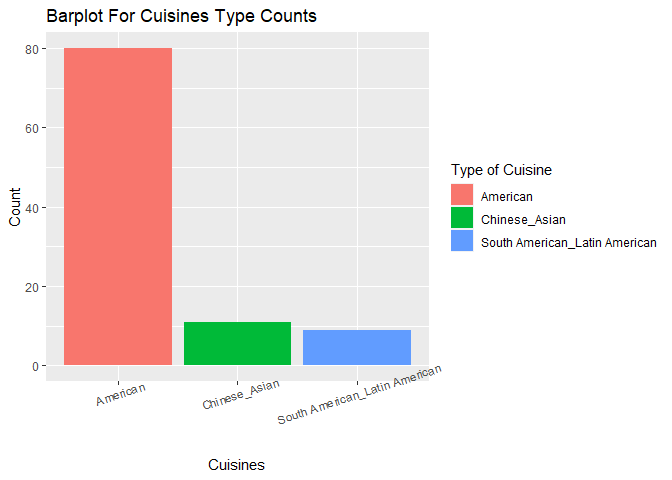
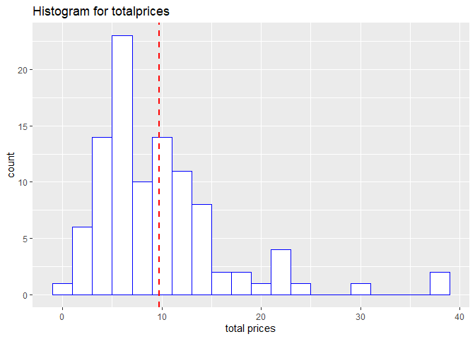
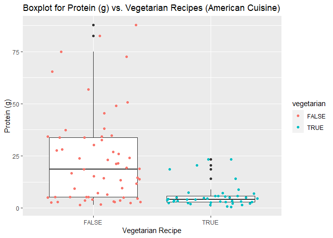
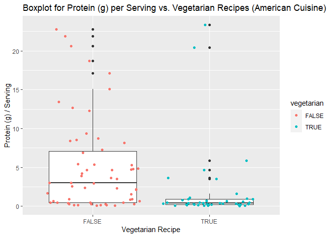
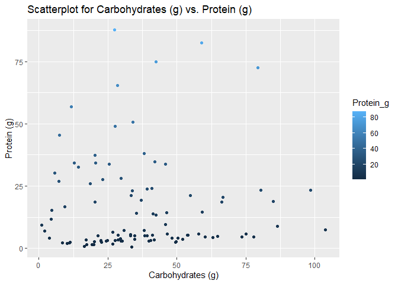
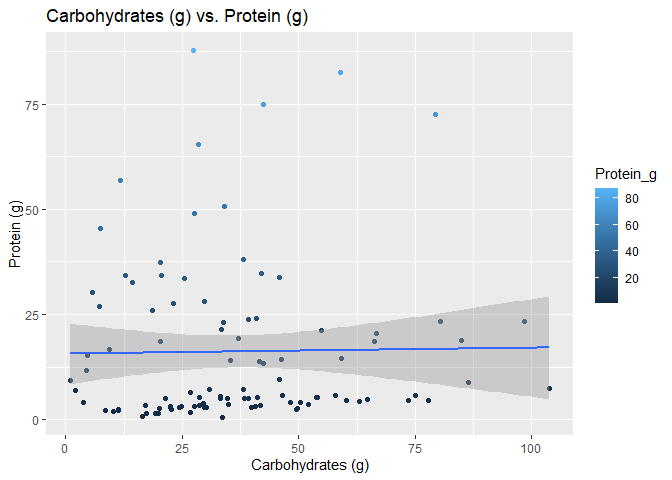

Project_2\_C
================
Suyog Dharmadhikari & Magaritte Nguyen
12 October, 2022

-   <a href="#spoonacular-recipe-and-food-api-vignette"
    id="toc-spoonacular-recipe-and-food-api-vignette">Spoonacular Recipe and
    Food API Vignette</a>
-   <a href="#requirements" id="toc-requirements">Requirements</a>
-   <a href="#api-interaction-functions"
    id="toc-api-interaction-functions">API Interaction Functions</a>
    -   <a href="#endpoint---1" id="toc-endpoint---1">EndPoint - 1</a>
    -   <a href="#endpoint---2" id="toc-endpoint---2">EndPoint - 2</a>
-   <a href="#data-exploration" id="toc-data-exploration">Data
    Exploration</a>
    -   <a href="#adding-new-variables-and-contingency-table"
        id="toc-adding-new-variables-and-contingency-table">Adding New Variables
        and Contingency Table</a>
    -   <a href="#summarizing-the-data"
        id="toc-summarizing-the-data">Summarizing The Data</a>
    -   <a href="#plots" id="toc-plots">Plots</a>

<!-- 
############################################################# 
#############################################################
Project 2 - Group 2C
############################################################# 
############################################################# 
-->

## Spoonacular Recipe and Food API Vignette

<!-- link to Wiki page on APIs: -->
<!-- [API] (https://en.wikipedia.org/wiki/API) -->

This document is a vignette to show how to retrieve data from an
[API](https://spoonacular.com/food-api/docs). To demonstrate, we will be
interacting with the Spoonacular Recipe and Food API. We are going to to
build a few functions to interact with some of the endpoints and explore
some of the data that we can retrieve for the Spoonacular API.

We will use a function that connects with `complexSearch`, which is an
end point of the API search. It returns a list of lists containing
recipe names and other variables of interest that have default values or
can be user defined. The user may either enter the type of cuisine,
recipes with a specific ingredient, number of recipes to output based on
modifications provided, type of diet, and protein range. We have another
function that can retrieve the data for multiple cuisines specified by
the user as well. We have a third function which can also be used to
contact other endpoint of the API, `findByNutrients` to get all the
recipes based on carbohydrate content.

## Requirements

To use the functions for interacting with the Spoonacular Recipe and
Food API, we used the following packages:

-   [`tidyverse`](https://www.tidyverse.org/): tons of useful features
    for data manipulation and visualization
-   [`jsonlite`](https://cran.r-project.org/web/packages/jsonlite/): API
    interaction

In addition to those packages, I used the following packages in the rest
of the document:

-   [`httr`](https://cran.r-project.org/web/packages/httr/): extra
    functionality for
-   [`knitr`](https://cran.r-project.org/web/packages/knitr/index.html):
    displaying tables in a markdown friendly way

**Note**: User needs to go to
[API_link](https://spoonacular.com/food-api/console#Profile), create a
profile and generate a **key**. This key will be used to `authenticate`
the user for each API calls.

<!-- setup -->

# API Interaction Functions

For this section, we have written some functions that will connect the
user to the Spoonacular API and returns a object with the required
information specified by the user.

<!-- Magaritte Nguyen's API Key -->
<!-- 1faaf57a0fbc433fa74f31a9419dc85b  -->

## EndPoint - 1

### `my_Spoonacular_API`

In this function we call `complexSearch` endpoint of the Spoonacular
API. The user can use this function to get the data from the API for
different types of cuisine, recipes with a specific ingredient, maximum
number of recipes to output, type of diet, and protein range. The
function is user friendly and handles upper and lower case scenarios
with spaces. **`GET`** from `httr` is used to connect with the API and
retrieved the required information while `fromJSON` is used to convert
the raw data into a readable format.

Just some extra information on how to use the `my_spoonacular_api`: we
are only able to specify one cuisine at a time, or else a message might
appear letting the user know what is appropriate in this field. We can
also specify one ingredient, but if there is nothing that matches, then
the results will just be 0 recipes.if the user would like some nutrient
information as well, they can input TRUE or FALSE for this parameter.
Lastly, we have different diets that the user can specify, such as
vegetarian etc., and the amount of protein in grams (min and max range).

**NOTE**: user cannot fetch more than 100 records in the single call as
it is restricted by the API.

``` r
# Query will only return words in the title of the recipe
# If set to true, you get nutritional information about each recipes returned.
# 100 is the max number of results you can get back for a single query.
my_Spoonacular_API <- function (cuisinetxt ="American", ingredient = "fruit", nutrientinfo = "TRUE", number=100, diet = "", minProtein = 10, maxProtein = 100 ){

  #valid cuisines to enter into the cuisine parameter
  #using tolower() to make everything lowercase for east of search
  #using str_replace_all for searches that are more than one word e.g. Latin American
  if ( ! any(str_replace_all(tolower(cuisinetxt), " ", "-") %in% str_replace_all( tolower(c("African", "American", "British", "Cajun", "Caribbean", "Chinese", "Eastern European", "European", "French", "German", "Greek", "Indian", "Irish", "Italian",   "Japanese", "Jewish", "Korean", "Latin American", "Mediterranean", "Mexican", "Middle Eastern", "Nordic", "Southern", "Spanish", "Thai", "Vietnamese")), " ", "-" ) ) ) { stop ('Please only include an acceptable cuisine input seen below: 

"African", "American", "British", "Cajun", "Caribbean", "Chinese", "Eastern European", "European", "French", "German", "Greek", "Indian", "Irish", "Italian",   "Japanese", "Jewish", "Korean", "Latin American", "Mediterranean", "Mexican", "Middle Eastern", "Nordic", "Southern", "Spanish", "Thai", "Vietnamese" 

*** If you include more than one cuisine seperated by a comma, ignore this message.') 
  } #end of cuisine check
  
  #using GET to return info about a topic that we are interested in 
  myGET <- GET(url=paste0("https://api.spoonacular.com/recipes/complexSearch?cuisine=", cuisinetxt, "&includeIngredients=", ingredient, "&addRecipeNutrition=", nutrientinfo, "&number=",number,"&diet=",diet,"&minProtein",minProtein,"&maxProtein",maxProtein,"&apiKey=",params$`api-key`))  
  
  #looking at content (raw data) and converting it into something we can read from myGET  
  #data
  spoonacular <- fromJSON(rawToChar(myGET$content))
  spoonacular$cuisinetxt <- cuisinetxt
  
  #results returned as a dataframe
  return(spoonacular)
  
} #end of function that called API
```

### `my_multiCuisine_API`

In this function we call `complexSearch` endpoint of the API. It is
similar to `my_Spoonacular_API` but in this function the user can enter
multiple cuisines to get the combined data of all the cuisines. The user
has to use `paste` with `collapse = ","` as the parameter to create a
list of cuisines before passing it to the function.

**NOTE**: user cannot fetch more than 100 records in the single call as
it is restricted by the API.

``` r
# Function for multiple cuisines in the cuisinetxt parameter
  my_multiCuisine_API <- function (cuisinetxt =" ", ingredient = "", nutrientinfo = "TRUE", number=100, diet = "", minProtein = 10, maxProtein = 100 ){
    
   myGETTemp <- GET(url=paste0("https://api.spoonacular.com/recipes/complexSearch?cuisine=", cuisinetxt, "&includeIngredients=", ingredient, "&addRecipeNutrition=", nutrientinfo, "&number=", number,"&diet=",diet,"&minProtein",minProtein,"&maxProtein",maxProtein,"&apiKey=",params$`api-key`))  
  
   return(myGETTemp)
  }
```

## EndPoint - 2

### `findRecipeByNutrients`

The `findByNutrients` endpoint of the API is called in the method below.
The function can assist users in retrieving data on the nutritional
value of recipes. To choose dishes from the specified **carbohydrate
content** and certain number of recipes output, the user can alter the
carbohydrates range. It returns the object along with some information
on the recipe, its nutrient content, and other parameters. **`GET`**
from `httr` is used to connect with the API and get the required
information while `fromJSON` is used to convert the raw data into
readable format.

**NOTE**: user cannot fetch more than 100 records in the single call as
it is restricted by the API.

``` r
# Looking for the given number of recipes with minCarbs and maxCarbs
findRecipeByNutrients <- function(minCarbs = 10, maxCarbs = 100, numberOfRecipes = 100){
   getURL <- paste0("https://api.spoonacular.com/recipes/findByNutrients?minCarbs=",minCarbs,"&maxCarbs=",maxCarbs,"&number=",numberOfRecipes,"&apiKey=",params$`api-key`)
  foodData <- GET(getURL)
  findByNutrientsDF <- fromJSON(rawToChar(foodData$content))
  return(findByNutrientsDF)   
}
```

In the code chunk below, we have called `my_Spoonacular_API()` and
`findRecipeByNutrients()`, which creates objects for different cuisines
with different ingredients and other parameters. The user can reference
this section of the vignette as an example call, if they want to get
information about different cuisines with different modifications.

``` r
#Example calls for my_Spoonacular_API
AmericanCuisineInfo <- my_Spoonacular_API (cuisinetxt ="American", ingredient = "fruit", nutrientinfo = "TRUE", number=100, diet = "", minProtein = 0, maxProtein = 100)

LatinAmericanCuisineInfo <- my_Spoonacular_API (cuisinetxt = "Latin American", ingredient = "salt", nutrientinfo = "TRUE", number=100, diet = "", minProtein = 10, maxProtein = 100)

ChineseCuisineInfo <- my_Spoonacular_API (cuisinetxt = "Chinese", ingredient = "cabbage", nutrientinfo = "TRUE", number=100, diet = "glutenFree", minProtein = 10, maxProtein = 100)

#Example calls for findRecipeByNutrients
dispDF <- findRecipeByNutrients(numberOfRecipes = 20)
```

These are the data frames containing nutrient information about the
particular cuisine, which can be used further for our data exploration
(EDA).

``` r
  AmericanCuisineInfotbl <- as_tibble(AmericanCuisineInfo$results)
  AmericanCuisineInfotbl
```

    ## # A tibble: 100 × 35
    ##    vegetarian vegan glutenF…¹ dairy…² veryH…³ cheap veryP…⁴ susta…⁵
    ##    <lgl>      <lgl> <lgl>     <lgl>   <lgl>   <lgl> <lgl>   <lgl>  
    ##  1 TRUE       TRUE  FALSE     TRUE    FALSE   FALSE FALSE   FALSE  
    ##  2 FALSE      FALSE TRUE      FALSE   TRUE    FALSE FALSE   FALSE  
    ##  3 FALSE      FALSE TRUE      FALSE   FALSE   FALSE FALSE   FALSE  
    ##  4 FALSE      FALSE FALSE     TRUE    TRUE    FALSE FALSE   FALSE  
    ##  5 FALSE      FALSE TRUE      TRUE    FALSE   FALSE FALSE   FALSE  
    ##  6 FALSE      FALSE FALSE     FALSE   FALSE   FALSE FALSE   FALSE  
    ##  7 FALSE      FALSE FALSE     FALSE   FALSE   FALSE FALSE   FALSE  
    ##  8 FALSE      FALSE FALSE     TRUE    FALSE   FALSE FALSE   FALSE  
    ##  9 FALSE      FALSE TRUE      FALSE   FALSE   FALSE FALSE   FALSE  
    ## 10 FALSE      FALSE FALSE     TRUE    FALSE   FALSE FALSE   FALSE  
    ## # … with 90 more rows, 27 more variables: lowFodmap <lgl>,
    ## #   weightWatcherSmartPoints <int>, gaps <chr>,
    ## #   preparationMinutes <int>, cookingMinutes <int>,
    ## #   aggregateLikes <int>, healthScore <int>, creditsText <chr>,
    ## #   sourceName <chr>, pricePerServing <dbl>, id <int>,
    ## #   title <chr>, readyInMinutes <int>, servings <int>,
    ## #   sourceUrl <chr>, image <chr>, imageType <chr>, …

``` r
  LatinAmericanCuisineInfoTbl <- as_tibble(LatinAmericanCuisineInfo$results)
  LatinAmericanCuisineInfoTbl
```

    ## # A tibble: 12 × 35
    ##    vegetarian vegan glutenF…¹ dairy…² veryH…³ cheap veryP…⁴ susta…⁵
    ##    <lgl>      <lgl> <lgl>     <lgl>   <lgl>   <lgl> <lgl>   <lgl>  
    ##  1 FALSE      FALSE TRUE      TRUE    TRUE    FALSE FALSE   FALSE  
    ##  2 FALSE      FALSE TRUE      TRUE    TRUE    FALSE FALSE   FALSE  
    ##  3 FALSE      FALSE TRUE      TRUE    FALSE   FALSE FALSE   FALSE  
    ##  4 FALSE      FALSE TRUE      TRUE    FALSE   FALSE FALSE   FALSE  
    ##  5 FALSE      FALSE FALSE     TRUE    FALSE   FALSE FALSE   FALSE  
    ##  6 FALSE      FALSE TRUE      TRUE    FALSE   FALSE FALSE   FALSE  
    ##  7 FALSE      FALSE TRUE      TRUE    FALSE   FALSE FALSE   FALSE  
    ##  8 FALSE      FALSE TRUE      TRUE    FALSE   FALSE FALSE   FALSE  
    ##  9 TRUE       TRUE  TRUE      TRUE    FALSE   FALSE FALSE   FALSE  
    ## 10 TRUE       FALSE TRUE      FALSE   FALSE   FALSE FALSE   FALSE  
    ## 11 FALSE      FALSE TRUE      FALSE   FALSE   FALSE FALSE   FALSE  
    ## 12 FALSE      FALSE TRUE      TRUE    FALSE   FALSE FALSE   FALSE  
    ## # … with 27 more variables: lowFodmap <lgl>,
    ## #   weightWatcherSmartPoints <int>, gaps <chr>,
    ## #   preparationMinutes <int>, cookingMinutes <int>,
    ## #   aggregateLikes <int>, healthScore <int>, creditsText <chr>,
    ## #   sourceName <chr>, pricePerServing <dbl>, id <int>,
    ## #   title <chr>, readyInMinutes <int>, servings <int>,
    ## #   sourceUrl <chr>, image <chr>, imageType <chr>, …

``` r
  ChineseCuisineInfoTbl <- as_tibble(ChineseCuisineInfo$results)
  ChineseCuisineInfoTbl
```

    ## # A tibble: 4 × 34
    ##   vegetarian vegan glutenFree dairy…¹ veryH…² cheap veryP…³ susta…⁴
    ##   <lgl>      <lgl> <lgl>      <lgl>   <lgl>   <lgl> <lgl>   <lgl>  
    ## 1 FALSE      FALSE TRUE       TRUE    TRUE    FALSE FALSE   FALSE  
    ## 2 FALSE      FALSE FALSE      TRUE    FALSE   FALSE FALSE   FALSE  
    ## 3 FALSE      FALSE FALSE      TRUE    FALSE   FALSE FALSE   FALSE  
    ## 4 FALSE      FALSE TRUE       TRUE    FALSE   FALSE FALSE   FALSE  
    ## # … with 26 more variables: lowFodmap <lgl>,
    ## #   weightWatcherSmartPoints <int>, gaps <chr>,
    ## #   preparationMinutes <int>, cookingMinutes <int>,
    ## #   aggregateLikes <int>, healthScore <int>, creditsText <chr>,
    ## #   license <chr>, sourceName <chr>, pricePerServing <dbl>,
    ## #   id <int>, title <chr>, readyInMinutes <int>, servings <int>,
    ## #   sourceUrl <chr>, image <chr>, imageType <chr>, …

``` r
  dispDFTbl <- as_tibble(dispDF) 
  dispDFTbl
```

    ## # A tibble: 20 × 8
    ##         id title          image image…¹ calor…² protein fat   carbs
    ##      <int> <chr>          <chr> <chr>     <int> <chr>   <chr> <chr>
    ##  1  634010 Banana Bread … http… jpg         211 4g      9g    31g  
    ##  2  634141 Banana Oatmea… http… jpg         148 4g      3g    27g  
    ##  3  634931 Best Soft Gin… http… jpg          75 1g      2g    13g  
    ##  4  635856 Braised Pork:… http… jpg         583 16g     47g   31g  
    ##  5  637440 Chapchae (Kor… http… jpg         397 5g      15g   64g  
    ##  6  638496 Chickpea and … http… jpg         272 9g      12g   36g  
    ##  7  643244 Four-Ingredie… http… jpg         162 5g      1g    37g  
    ##  8  649048 Korean Extra … http… jpg         937 56g     51g   60g  
    ##  9  649314 Lavash         http… jpg         278 7g      9g    46g  
    ## 10  655249 Peanut Butter… http… jpg         359 8g      23g   34g  
    ## 11  657095 Prawn Curry    http… jpg         458 29g     17g   47g  
    ## 12  657226 Pulled Pork S… http… jpg         873 83g     34g   59g  
    ## 13  657889 Raspberry Pea… http… jpg         164 2g      5g    29g  
    ## 14  658151 Refreshing Zu… http… jpg         331 4g      29g   17g  
    ## 15  660525 Soft-Baked Pr… http… jpg         376 7g      22g   41g  
    ## 16  661843 Strawberry Ma… http… jpg         441 3g      25g   55g  
    ## 17  663824 Trinidadian C… http… jpg         554 35g     37g   20g  
    ## 18  716195 Spicy Indian-… http… jpg         134 5g      6g    15g  
    ## 19 1062883 How to Make E… http… jpg         345 13g     14g   43g  
    ## 20 1077393 Easter Sugar … http… jpg         573 8g      25g   80g  
    ## # … with abbreviated variable names ¹​imageType, ²​calories

# Data Exploration

## Adding New Variables and Contingency Table

In this section we have created two new variables and added them to the
data frame and also created three contingency tables explaining the
**association** between the variables of the dataframes. The nutrients
tibble is extracted from the `AmericanCuisineInfo` data frame.

### Adding New Variables

In the below code chunk the information extracted from the API does not
have information related to **total price** of the recipe and **proteins
per serving**. Some variables of interest provided in the data was
information about `price per serving`, `total servings` and
`total_protein`. We used these variables and created two new variables
`totalprice` and `protein_per_serving`.

It was interesting to find out that total price provided in the API was
in pennies. So, for `total price` we calculated this by multiplying
`price per serving` and `servings` then dividing by 100 to get a dollar
amount for `total price`. For `protein per serving` we divided amount of
protein in a recipe by total number of servings the recipe made.

Some nutrients that we were interested in were calories, protein, fat,
and carbohydrates.

``` r
# Example for data exploration
# American cuisine info object that was created above
CuisineInfo <- AmericanCuisineInfo

# viewing nutrients data frame nested inside results list
View(CuisineInfo$results$nutrition$nutrients[[1]])

# want to look at calories, protein, carbs, fat
# bind_rows - binding row wise for all lists
# nutrients is a list of dataframes
nutrients <- bind_rows(CuisineInfo$results$nutrition$nutrients, .id="df") %>%
  as_tibble() %>% 
  filter (name %in% c("Calories", "Protein", "Fat", "Carbohydrates")) %>%
  pivot_wider(id_cols=df, names_from=c(name, unit), values_from=amount) %>% 
  bind_cols (CuisineInfo$results[,c("id","title", "vegetarian", "vegan", "pricePerServing", "readyInMinutes", "servings")]) %>%
  mutate (totalprice = (pricePerServing*servings)/100, protein_per_serving = (Protein_g/servings ) )
# results is a data frame that we can use to do EDA
# cost per serving is in pennies.
# I converted total price/cost to make the recipe in USD

# output nutrients tibble
nutrients
```

    ## # A tibble: 100 × 14
    ##    df    Calorie…¹ Fat_g Carbo…² Prote…³     id title veget…⁴ vegan
    ##    <chr>     <dbl> <dbl>   <dbl>   <dbl>  <int> <chr> <lgl>   <lgl>
    ##  1 1          590. 21.9    80.5     23.4 6.43e5 Fala… TRUE    TRUE 
    ##  2 2          393. 29.0     7.17    26.9 6.47e5 Salm… FALSE   FALSE
    ##  3 3          455. 25.9    25.6     33.7 6.39e5 Chil… FALSE   FALSE
    ##  4 4          479.  8.77   85.0     18.7 6.51e5 Masa… FALSE   FALSE
    ##  5 5          450. 17.5    11.7     56.9 6.60e5 Slow… FALSE   FALSE
    ##  6 6          475. 18.2    27.7     49.0 6.38e5 Chee… FALSE   FALSE
    ##  7 7          971. 69.6    34.0     50.6 7.76e5 Gorg… FALSE   FALSE
    ##  8 8          755. 20.5    58.9     82.6 6.57e5 Pull… FALSE   FALSE
    ##  9 9          588. 23.9    28.6     65.4 6.62e5 Supe… FALSE   FALSE
    ## 10 10         311.  8.83   33.8     23.2 1.10e6 Salm… FALSE   FALSE
    ## # … with 90 more rows, 5 more variables: pricePerServing <dbl>,
    ## #   readyInMinutes <int>, servings <int>, totalprice <dbl>,
    ## #   protein_per_serving <dbl>, and abbreviated variable names
    ## #   ¹​Calories_kcal, ²​Carbohydrates_g, ³​Protein_g, ⁴​vegetarian

### Contingency Table

In the below chunk of code, we created contingency tables to find the
associations between `vegan and vegetarian`, `Source and Healthy`,
`Source and Expensive`.

In the `vegan and vegetarian` contingency table, we see that there are
**5 vegan recipes** in the **American** Cuisine with fruit being the
ingredient that is being searched. So, we can conclude that some
vegetarian recipes are vegan as well. This is as expected.

In the `Source and Healthy` contingency table, we could see that most of
the unhealthy food recipes are from **Foodista** source. Now we know
which website to avoid for healthy food options.

In the `Source and Expensive` contingency table, we added one more
variable to the dataframe called **expensive**, which was a category we
defined if the price per serving was higher than Q3. Here, we can see
that the recipes suggested by **Foodista** has the **maximum number** of
**expensive** recipes, but also suggests **maximum number** of
**inexpensive** recipes.

``` r
# make 3 contingency tables
# vegetarian, vegan 
VegConTbl <- base::table("Vegan" = nutrients$vegan, "Vegetarian" = nutrients$vegetarian)
VegConTbl
```

    ##        Vegetarian
    ## Vegan   FALSE TRUE
    ##   FALSE    59   36
    ##   TRUE      0    5

``` r
# sourceName and Healthy
sourceHealthyConTbl <- base::table("Source" = CuisineInfo$results$sourceName, "Healthy" = CuisineInfo$results$veryHealthy ) 
sourceHealthyConTbl
```

    ##                   Healthy
    ## Source             FALSE TRUE
    ##   A Southern Grace     1    0
    ##   Afrolems             2    0
    ##   blogspot.com         1    0
    ##   Foodista            70    1
    ##   foodista.com        20    1
    ##   Pink When            2    0
    ##   spoonacular          2    0

``` r
#create category
#price expensive
#price in pennies
new_CuisineQuery <- CuisineInfo$results %>% 
  mutate ( "expensive" = pricePerServing >= quantile(CuisineInfo$results$pricePerServing, 0.75))

sourceExpensivecontTable <- base::table("Source" = CuisineInfo$results$sourceName, "Expensive" = new_CuisineQuery$expensive ) 
sourceExpensivecontTable
```

    ##                   Expensive
    ## Source             FALSE TRUE
    ##   A Southern Grace     1    0
    ##   Afrolems             1    1
    ##   blogspot.com         0    1
    ##   Foodista            60   11
    ##   foodista.com        11   10
    ##   Pink When            1    1
    ##   spoonacular          1    1

## Summarizing The Data

In this section we are summarizing the data by using the following
functions `mean()`, `median()`, `desc()`, `select()`, `summarise()`, and
`sppaly()`.

In the following code chunk, for the `mean_protein` object, we did a
mean price breakdown with a `group_by()` function with vegetarian and
non vegetarian. In the `highProteinRecipes` object, we can see that
**Cinnamon French Toast Sticks** has higher protein than **Turkey
Burgers with Slaw** even though it is a vegetarian recipe. This is
surprising, but also makes sense due to the protein content in eggs.

``` r
# mean price breakdown by group - vegetarian and non vegetarian
# from data above in other code chunk
mean_protein <- nutrients %>%
  group_by (vegetarian) %>%
  summarise("Count" = n(), "Mean" = mean(Protein_g), "SD" = sd(Protein_g), "Med." = median(Protein_g), "Min."=min(Protein_g), "Max." = max(Protein_g))


# protein content per serving size (for the recipes)
# view the data to see what the protein per serving is.
highProteinRecipes <- nutrients %>% 
  select (vegetarian, vegan, title, protein_per_serving, Protein_g, servings) %>%
  arrange (desc(protein_per_serving)) %>%
  head(5) 
```

In the code chunk below we have created objects by fetching the
information of multiple cuisines from the Spoonacular API. `paste()` is
used along with `collapse` to pass as a parameter to the
`my_multiCuisine_API()` custom function. The code chunk returns a tibble
containing the number of recipes for each cuisine in the data that we
extracted for all the ingredients and given protein range. It can be
seen that the number of **American** cuisine recipes are much **higher**
in comparison to **Chinese** and **Latin American** cuisines.

``` r
  # Vector of multiple cuisines
  cuisinetxt <- c("American", "chinese", "Latin American")
  
  # Using paste to create a text string of cuisine types to fetch information 
  cuisineComb <- paste(cuisinetxt, collapse = ",")
  
  # Calling my_multiCuisine_API function to get the combined information
  MultiCuisineInfoObj <- my_multiCuisine_API(cuisinetxt = cuisineComb, ingredient = "", nutrientinfo =  
                  "TRUE", number=100, diet = "", minProtein = 10, maxProtein = 100)    
  
  # Object with parsed data collected from API   
  spoonacularTemp <- fromJSON(rawToChar(MultiCuisineInfoObj$content))
  
  # Summarizing n counts based on cuisines 
  MultiCuisineInfo <- spoonacularTemp$results %>%
    group_by(cuisines) %>% 
    summarize(count=n()) %>% 
    filter(cuisines != "character(0)")
   
  # unlist the list of cuisine names and combining it into single name using apply
  cuisineInfoTemp <- apply(MultiCuisineInfo, 1, function(y) sapply(y, function(x) paste(unlist(x), 
                           collapse="_")))
   
  # Taking transpose of the df to makes it useful for plotting
  cuisineInfoTempTranspose <- t(cuisineInfoTemp)
   
  # Converting it to tibble
  MultiCuisineInfoTbl <- as_tibble(cuisineInfoTempTranspose)
   
  # The count variable was character, used sapply to conver it into numeric
  MultiCuisineInfoTbl$count <- sapply(MultiCuisineInfoTbl$count, as.numeric)
  
  # Multicuisine output tibble 
  MultiCuisineInfoTbl
```

    ## # A tibble: 3 × 2
    ##   cuisines                      count
    ##   <chr>                         <dbl>
    ## 1 Chinese_Asian                    11
    ## 2 American                         80
    ## 3 South American_Latin American     9

## Plots

In this section, we did data exploration through multiple plots - like
**bar plot**, **histogram**, **boxplot**, **scatter plot**, and
**scatter plot with linear model**.

In the code chunk below, we have used a bar plot to show the recipe
count variations among the different cuisines. In this code chunk we
have used `geom_bar()` for bar plot and `theme()` to tilt the x-axis
names as they are overlapping. It can be seen from the plot that
**American** cuisine has **highest** number of recipes with all the
ingredients with protein range between 10-100.

``` r
barPlot <- function(df, xVar, yVar){
  
   g <- ggplot(data = df , aes(x = xVar, y = yVar))
   g + geom_col(aes(fill = as.factor(xVar))) + scale_fill_discrete(name = "Type of Cuisine") +
   xlab("Cuisines") + ylab("Count") +
   ggtitle("Barplot For Cuisines Type Counts") + theme(axis.text.x = element_text(angle = 18))
}

barPlot(MultiCuisineInfoTbl,MultiCuisineInfoTbl$cuisines,MultiCuisineInfoTbl$count)
```

<!-- -->

In this histogram, we have plotted for **total price variation** for
**American** cuisine. We have used `geom_histogram()` for the histogram
plot and added another layer to it using `geom_vline()`, showing the
mean of **total prices** on the histogram plot. The histogram plots does
not look like a normal distribution. It looks like it skewed towards the
right. Maybe in future data exploration, we can transform the data into
something more familiar and be able to draw conclusions from that
familiar distribution.

``` r
histPlot <- function(df, xVar, bin_width = 2){
  g <- ggplot(data = df , aes(x = xVar))
  g + geom_histogram(binwidth = bin_width, color="blue", fill="white") +
  geom_vline(aes(xintercept=mean(xVar)),
            color="red", linetype="dashed", size=1) + 
  xlab("total prices") + ggtitle("Histogram for totalprices")
}

histPlot(nutrients, nutrients$totalprice)
```

<!-- --> In this box plot we
are looking to determine how much protein is present in the vegetarian
and non vegetarian meals. We have used `geom_boxplot()` for this scatter
plot and added a jitter layer using `geom_point()`. When looking at the
protein content in the vegetarian and non vegetarian recipes, protein is
not non-existent in vegetarian meals. This is a common misconception.
The number of recipes for each category also do not differ much. Also,
we see that the protein content in non vegetarian meals in generally
much greater than the protein content in vegetarian meals. Even the
outliers are only a little more than the median protein content in the
non vegetarian meals. Something to consider is how many serving size
each recipe is. This may contribute to a large difference in protein.

``` r
# boxplot()
# setting the stage to add layers
# how much protein is in vegetarian meals 
g <- ggplot(nutrients, aes(x = vegetarian, y = Protein_g))
# boxplot for Protein by Vegetarian 
g + geom_boxplot() + 
    labs(title = paste0("Boxplot for Protein (g) vs. Vegetarian Recipes (", CuisineInfo$cuisinetxt, " Cuisine)"), x = "Vegetarian Recipe", y = "Protein (g)") +
    geom_point(aes(color=vegetarian), position="jitter") 
```

<!-- --> In this box plot we
will be looking at how much protein is in vegetarian meals per serving.
We have used `geom_boxplot()` for this scatter plot and added a jitter
layer using `geom_point()`. From the plot, interestingly enough, when
broken down by serving, the protein content in vegetarian meals (for
some) have a higher protein content then the non vegetarian meals.
Compared to the boxplot above this is an interesting finding.

``` r
# boxplot()
# setting the stage to add layers
# how much protein is in vegetarian meals per serving to see if there is any difference...
g <- ggplot(nutrients, aes(x = vegetarian, y = protein_per_serving))
# boxplot for Protein by Vegetarian 
g + geom_boxplot() + 
    labs(title = paste0("Boxplot for Protein (g) per Serving vs. Vegetarian Recipes (", CuisineInfo$cuisinetxt, " Cuisine)"), x = "Vegetarian Recipe", y = "Protein (g) / Serving") +
    geom_point(aes(color=vegetarian), position="jitter")
```

<!-- --> In this scatter
plot, we tried to see the relationship between protein and carbohydrates
of a particular cuisine. Here, `geom_point()` was used and we can see
that there is **no real pattern** to be observed between carbohydrates
and protein. A few points may indicate increase when either one is
increased, but over all protein stays low no matter how the carbohydrate
content varies.

``` r
# seperate scatter plot
# Carbohydrates_g vs. Protein_g
# setting the stage to add layers
g <- ggplot(nutrients, aes(x = Carbohydrates_g, y = Protein_g))
# scatter plot with linear regression line for carbs by protein
g + geom_point(aes(color=Protein_g), position="jitter") +
    labs(title = "Scatterplot for Carbohydrates (g) vs. Protein (g)", x="Carbohydrates (g)", y="Protein (g)") 
```

<!-- --> In this scatter
plot, we have added a layer for the regression line using the
`geom_smooth()` function. After seeing the plot, we can see that the
regression line basically has **No change** in protein (g) at any amount
of carbohydrates. This is similar to the plot above.

``` r
#setting the stage to add layers
g <- ggplot(nutrients, aes(x = Carbohydrates_g, y = Protein_g))
#scatter plot with linear regression line for carbs by protein
g + geom_point(aes(color=Protein_g), position="jitter") +
    labs(title = "Carbohydrates (g) vs. Protein (g)", x="Carbohydrates (g)", y="Protein (g)") + 
    geom_smooth(method = lm) 
```

<!-- --> \# Wrap up

<!-- Need to write the summary in brief -->

To summarize everything that we did in this vignette please see the
following:

-   Built custom functions to interact with some of the Spoonacular Food
    and Recipe API endpoints like ComplexSearch and findByNutrients

-   Retrieved some of the data based on different user modifications

-   Did exploratory data analysis (EDA):

    -   Using contingency tables

    -   Numerical summaries like mean, median, min, max, standard
        standard deviaiton

    -   Data visualization methods like plotting – bar plot, box plot,
        histogram, scatter plot, scatter plots with linear models
        overlayed.

Some interesting findings for our specific vingette examples:

-   Some vegetarian recipes are vegan as well

-   Most of the unhealthy food recipes are from the **Foodista** source

-   Recipes suggested by **Foodista** has the **maximum number** of
    **expensive** recipes, but also suggests **maximum number** of
    **inexpensive** recipes

-   **Cinnamon French Toast Sticks** has a higher protein content than a
    non vegetarian meals like the **Turkey Burgers with Slaw**, even
    though it is a vegetarian recipe. This is surprising, but also makes
    sense due to the high protein content in eggs

-   It can be seen that the number of **American** cuisine recipes are
    much **higher** in comparison to **Chinese** and **Latin American**
    cuisines for our vignette for the recipes containing fruit.

-   The protein content in non vegetarian meals in generally much
    greater than the protein content in vegetarian meals as expected

-   When broken down by serving, the protein content in vegetarian meals
    (for some) have a higher protein content then the non vegetarian
    meals

-   There is **no real pattern** to be observed between carbohydrates
    and protein

-   The regression line basically has **No change** in protein (g) at
    any amount of carbohydrates, confirming out plot that is only a
    scattet plot between protein and carbohydrates

We hope this vignette will help the user to interact with spoonacular
API and do the required exploratory analysis.
